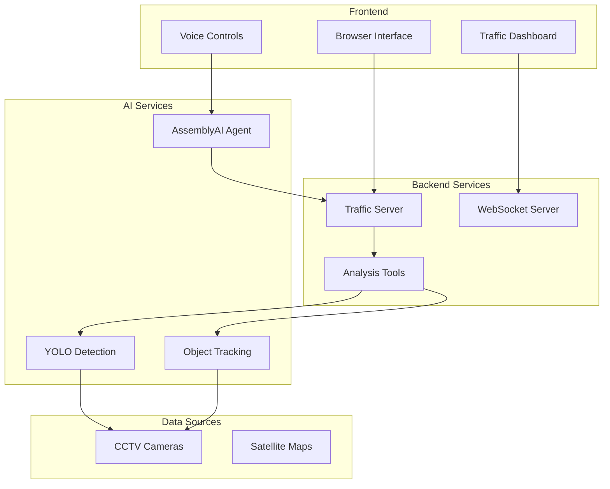

# Architecture Overview

## System Components

The GeoPilot Traffic Surveillance system consists of four main components:

### 1. [[Voice Agent]]
- **Technology**: [[AssemblyAI Voice Agent API]]
- **Purpose**: Natural language interface for traffic monitoring
- **Port**: 3000 (browser), API (AssemblyAI cloud)

### 2. [[Traffic Server]]
- **Technology**: [[FastAPI]] + [[Python]]
- **Purpose**: Traffic analysis and data processing
- **Port**: 8000

### 3. [[Browser Interface]]
- **Technology**: HTML/CSS/JavaScript
- **Purpose**: User interface for voice interaction
- **Port**: 3000

### 4. [[Camera Network]]
- **Technology**: [[YOLO]] + [[OpenCV]]
- **Purpose**: Vehicle detection and tracking
- **Integration**: CCTV feeds

## Component Diagram

## Data Flow

1. **Input Stage**
   - Voice commands → [[AssemblyAI]] → Text
   - CCTV feeds → [[YOLO]] → Detections

2. **Processing Stage**
   - Detections → [[Object Tracking]] → Vehicle data
   - Vehicle data → [[Traffic Analysis]] → Statistics

3. **Output Stage**
   - Statistics → [[Dashboard]] → Visualization
   - Statistics → [[Voice Agent]] → Speech response
   - Incidents → [[Alert System]] → Notifications

## Integration Points

### AssemblyAI Integration
- **Endpoint**: `wss://api.assemblyai.com/v2/realtime`
- **Protocol**: WebSocket
- **Auth**: API key in header

### TrafficLab-3D Integration
- **Calibration**: Camera homography
- **Detection**: YOLO model inference
- **Visualization**: Digital twin rendering

### External Services
- **Twilio**: Phone alerts (optional)
- **EXA Search**: Incident research (optional)

## Security Considerations

> [!warning] Security Notes
> - API keys stored in environment variables
> - WebSocket connections require authentication
> - Camera access restricted by network policy
> - Voice data processed in real-time, not stored

## Performance Requirements

| Metric | Target | Current |
|--------|--------|---------|
| Voice latency | < 500ms | ~300ms |
| Detection FPS | 30 fps | 25 fps |
| API response | < 100ms | ~50ms |
| WebSocket updates | 1s | 1s |

## Related Pages

- [[Component Diagram]]
- [[Data Flow]]
- [[Integration Points]]
- [[Performance Optimization]]

## Tags

#architecture #system-design #components #integration

---

*Part of [[GeoPilot Traffic Surveillance]]*
