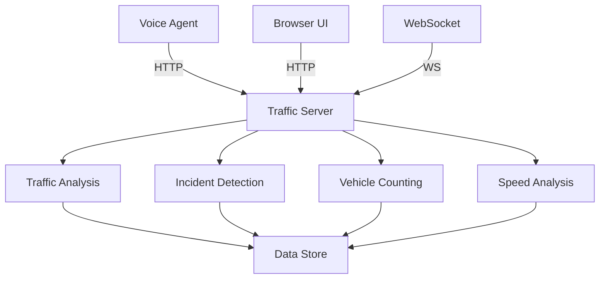

# Traffic Server

## Overview

The Traffic Server is the backend service that processes traffic data, runs analysis, and serves the API endpoints for the voice agent and dashboard.

**Technology**: [[FastAPI]] + [[Python]]
**Port**: 8000

## Architecture



## Components

### 1. API Layer

FastAPI application with CORS support:

```python
app = FastAPI(
    title="GeoPilot Traffic Surveillance API",
    description="Voice-controlled traffic surveillance and analysis system",
    version="1.0.0"
)

app.add_middleware(
    CORSMiddleware,
    allow_origins=["*"],
    allow_credentials=True,
    allow_methods=["*"],
    allow_headers=["*"],
)
```

### 2. Data Models

Pydantic models for request/response validation:

```python
class VehicleType(str, Enum):
    CAR = "car"
    TRUCK = "truck"
    BUS = "bus"
    MOTORCYCLE = "motorcycle"
    BICYCLE = "bicycle"
    PEDESTRIAN = "pedestrian"

class SeverityLevel(str, Enum):
    LOW = "low"
    MEDIUM = "medium"
    HIGH = "high"
    CRITICAL = "critical"
```

### 3. Data Store

In-memory data store (replace with database in production):

```python
class TrafficDataStore:
    def __init__(self):
        self.cameras: Dict[str, CameraInfo] = {}
        self.vehicle_data: List[VehicleData] = []
        self.incidents: List[Incident] = []
        self.alert_thresholds: Dict[str, Dict[str, float]] = {}
```

### 4. Analysis Tools

Traffic analysis functions:

| Function | Description |
|----------|-------------|
| `get_traffic_stats()` | Get camera statistics |
| `detect_incidents()` | Find incidents by area |
| `get_vehicle_count()` | Count vehicles by type |
| `analyze_traffic_flow()` | Analyze flow patterns |
| `get_speed_distribution()` | Speed statistics |
| `generate_report()` | Create traffic report |

## API Endpoints

### Health Check

```
GET /health
```

Response:
```json
{
  "status": "healthy",
  "service": "GeoPilot Traffic Surveillance",
  "cameras_online": 2
}
```

### Traffic Tools

See [[API Reference]] for complete endpoint documentation.

## WebSocket

### Connection

```
ws://localhost:8000/ws/traffic-updates
```

### Message Format

```json
{
  "type": "vehicle_detected",
  "timestamp": "2026-09-10T12:00:00Z",
  "data": {
    "camera_id": "cam_001",
    "vehicle_id": "veh_0047"
  }
}
```

## Configuration

### Environment Variables

| Variable | Description | Default |
|----------|-------------|---------|
| `TRAFFIC_SERVER_URL` | Server URL | `http://localhost:8000` |
| `DEFAULT_CAMERA_ID` | Default camera | `cam_001` |
| `ALERT_WEBHOOK_URL` | Alert webhook | - |

### Inference Config

Location: `config/inference_config.yaml`

```yaml
detection:
  model_path: "models/yolov8s.pt"
  confidence_threshold: 0.5
  nms_threshold: 0.4

tracking:
  tracker: "bytetrack"
  max_age: 30
  min_hits: 3
```

## Running

### Development

```bash
python tools/traffic_server.py
```

### Production

```bash
uvicorn tools.traffic_server:app --host 0.0.0.0 --port 8000 --workers 4
```

### Docker

```dockerfile
FROM python:3.9-slim

WORKDIR /app
COPY requirements.txt .
RUN pip install -r requirements.txt

COPY . .
CMD ["uvicorn", "tools.traffic_server:app", "--host", "0.0.0.0", "--port", "8000"]
```

## Testing

### Unit Tests

```bash
pytest tests/test_traffic_server.py
```

### API Tests

```bash
curl -X POST http://localhost:8000/tools/get_traffic_stats \
  -H "Content-Type: application/json" \
  -d '{"camera_id": "cam_001"}'
```

## Performance

| Metric | Target | Current |
|--------|--------|---------|
| Response time | < 100ms | ~50ms |
| Throughput | 1000 req/s | 500 req/s |
| Memory usage | < 512MB | ~256MB |

## Related Pages

- [[API Reference]]
- [[Data Models]]
- [[Configuration Guide]]
- [[Deployment Guide]]

## Tags

#backend #api #fastpython #server

---

*Part of [[GeoPilot Traffic Surveillance]]*
