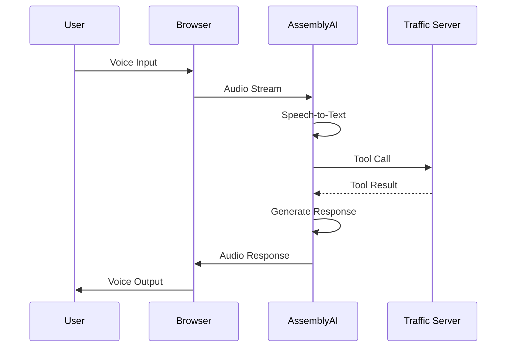

# Voice Agent

## Overview

The Voice Agent is the primary interface for interacting with the GeoPilot Traffic Surveillance system using natural language.

**Technology**: [[AssemblyAI Voice Agent API]]

## Architecture



## Configuration

### Agent Configuration File

Location: `agents/traffic-surveillance.jsonc`

```json
{
  "name": "GeoPilot Traffic Surveillance Agent",
  "system_prompt": "You are GeoPilot, an AI traffic surveillance assistant...",
  "voice": { "voice_id": "anna" },
  "greeting": "GeoPilot traffic surveillance active. What would you like to monitor?",
  "keyterms": [
    "GeoPilot",
    "TrafficLab",
    "incident detection",
    "vehicle count",
    "traffic flow"
  ],
  "tools": [...]
}
```

### System Prompt

The system prompt defines the agent's behavior:

> You are GeoPilot, an AI traffic surveillance assistant. You analyze real-time traffic data from CCTV feeds and provide voice-based alerts, reports, and analysis. You can detect anomalies, track vehicle counts, monitor traffic flow, identify incidents, and provide geospatial insights. Be concise, direct, and prioritize safety-critical information. Lead with the answer, skip preamble. Use technical terms accurately but explain complex findings simply.

### Voice Selection

Available voices:
- `anna` - Female, professional
- `james` - Male, authoritative
- `sarah` - Female, friendly
- `michael` - Male, calm

### Keyterms

Keyterms improve transcription accuracy for domain-specific terms:

```json
"keyterms": [
  "GeoPilot",
  "TrafficLab",
  "incident detection",
  "vehicle count",
  "traffic flow",
  "congestion",
  "anomaly detection",
  "surveillance",
  "CCTV",
  "digital twin",
  "geospatial",
  "homography",
  "YOLO",
  "object tracking"
]
```

## Tools

The voice agent can call the following tools:

| Tool | Description |
|------|-------------|
| `get_traffic_stats` | Get traffic statistics for a camera |
| `detect_incidents` | Check for incidents in an area |
| `get_vehicle_count` | Count vehicles by type |
| `analyze_traffic_flow` | Analyze flow patterns |
| `get_speed_data` | Get speed distribution |
| `generate_report` | Create traffic report |
| `set_alert_threshold` | Configure alerts |
| `get_camera_status` | Check camera network |

### Tool Implementation

Each tool is implemented as an HTTP endpoint:

```json
{
  "name": "get_traffic_stats",
  "description": "Get current traffic statistics for a specific camera or zone",
  "url": "http://localhost:8000/tools/get_traffic_stats",
  "method": "POST",
  "parameters": {
    "type": "object",
    "properties": {
      "camera_id": {
        "type": "string",
        "description": "CCTV camera identifier"
      }
    },
    "required": ["camera_id"]
  }
}
```

## Browser Integration

### HTML Client

Location: `deployment/browser/index.html`

Features:
- Voice controls (connect/disconnect)
- Real-time transcript
- Audio visualizer
- Quick commands

### WebSocket Connection

```javascript
const ws = new WebSocket('ws://localhost:3000/ws');

ws.onmessage = (event) => {
  const data = JSON.parse(event.data);
  // Handle voice agent messages
};
```

## Phone Integration (Optional)

### Twilio Setup

1. Create Twilio account
2. Get phone number
3. Configure SIP trunk
4. Update `.env`:

```env
TWILIO_ACCOUNT_SID=AC...
TWILIO_AUTH_TOKEN=your_token
TWILIO_PHONE_NUMBER=+1...
TWILIO_TRUNK_DOMAIN=acme-agent.pstn.twilio.com
```

### Run Phone Setup

```bash
python deployment/telephony/connect.py
```

## Session Management

### List Sessions

```bash
curl "https://agents.assemblyai.com/v1/sessions?limit=5" \
  -H "Authorization: $ASSEMBLYAI_API_KEY"
```

### Get Session Details

```bash
curl "https://agents.assemblyai.com/v1/sessions/$SESSION_ID" \
  -H "Authorization: $ASSEMBLYAI_API_KEY"
```

### Session Artifacts

Each session includes:
- **Audio**: OGG/Opus recording
- **Timeline**: Conversation JSON
- **Metadata**: Session information

## Best Practices

> [!tip] Optimization Tips
> - Keep system prompt concise
> - Use keyterms for accuracy
> - Test with various accents
> - Monitor session logs

> [!warning] Limitations
> - Requires stable internet
> - Background noise affects accuracy
> - Complex queries may need clarification

## Related Pages

- [[AssemblyAI Integration]]
- [[Voice Commands]]
- [[Browser Interface]]
- [[Configuration Guide]]

## Tags

#voice-agent #assemblyai #speech #interface

---

*Part of [[GeoPilot Traffic Surveillance]]*
