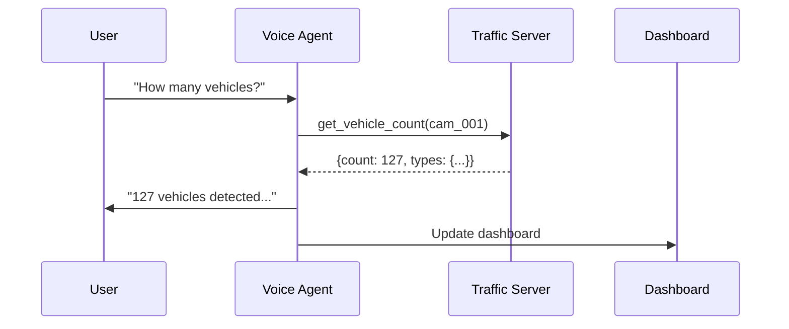

# Voice Commands

## Available Commands

The GeoPilot voice agent responds to natural language commands for traffic surveillance.

### Traffic Status

| Command | Description |
|---------|-------------|
| "What's the traffic status?" | Get current traffic overview |
| "Show me the traffic" | Display traffic dashboard |
| "How's the traffic?" | Traffic summary |
| "Traffic update" | Latest traffic information |

### Incident Detection

| Command | Description |
|---------|-------------|
| "Are there any incidents?" | Check for active incidents |
| "Any accidents?" | Check for collisions |
| "Show incidents" | List all incidents |
| "Incident alert" | Get incident notifications |
| "What's happening on [road]?" | Check specific road incidents |

### Vehicle Counting

| Command | Description |
|---------|-------------|
| "How many vehicles?" | Get vehicle count |
| "Vehicle count" | Current vehicle statistics |
| "Count vehicles on [camera]" | Specific camera count |
| "Vehicle breakdown" | Vehicle type classification |

### Traffic Flow

| Command | Description |
|---------|-------------|
| "Analyze [route] traffic" | Analyze specific route |
| "How's [highway]?" | Highway traffic status |
| "Traffic flow on [road]" | Flow analysis |
| "Is [road] congested?" | Congestion check |

### Speed Monitoring

| Command | Description |
|---------|-------------|
| "What's the average speed?" | Get speed statistics |
| "Speed data" | Speed distribution |
| "How fast are vehicles going?" | Speed overview |
| "Speed on [camera]" | Camera-specific speed |

### Reports

| Command | Description |
|---------|-------------|
| "Generate report" | Create traffic report |
| "Traffic report for today" | Daily report |
| "Last hour report" | Hourly summary |
| "Create incident report" | Incident-specific report |

### Camera Management

| Command | Description |
|---------|-------------|
| "Check camera status" | Camera network status |
| "Which cameras are online?" | Online cameras list |
| "Camera [id] status" | Specific camera status |
| "Any cameras offline?" | Offline camera alerts |

### Alert Configuration

| Command | Description |
|---------|-------------|
| "Set speed alert to [X]" | Configure speed threshold |
| "Alert me when congestion exceeds [X]%" | Congestion alert |
| "Set incident alert" | Configure incident alerts |
| "Disable alerts" | Turn off notifications |

---

## Command Examples

### Basic Queries

```
User: "What's the traffic status?"
GeoPilot: "Currently tracking 47 vehicles across 3 cameras. Average speed is 42 km/h with moderate congestion on Main Street."
```

### Incident Detection

```
User: "Are there any incidents?"
GeoPilot: "Yes, 1 active incident: Multi-vehicle collision on Main Street blocking the left lane. Severity: High. Reported 15 minutes ago."
```

### Vehicle Count

```
User: "How many vehicles detected?"
GeoPilot: "In the last hour: 127 vehicles detected. Breakdown: 89 cars, 18 trucks, 12 buses, 8 motorcycles."
```

### Traffic Analysis

```
User: "Analyze Highway 101 traffic"
GeoPilot: "Highway 101 Northbound: Traffic flowing normally. Average speed 65 km/h, 89 vehicles detected. No incidents reported."
```

### Report Generation

```
User: "Generate traffic report"
GeoPilot: "Generating traffic report for today. Summary: 1,247 total vehicles, 2 incidents, average congestion 35%. Report saved."
```

### Camera Status

```
User: "Check camera status"
GeoPilot: "Camera Network Status: 2 online, 1 offline, 1 in maintenance. cam_003 (Downtown Intersection) is in maintenance mode."
```

---

## Tips for Best Results

> [!tip] Voice Command Tips
> - Speak clearly and at normal pace
> - Use specific camera IDs when possible
> - Include time ranges for queries
> - Use natural language - no need for exact phrases

### Supported Time Ranges

| Format | Example |
|--------|---------|
| Minutes | "5 minutes", "5m", "last 5 minutes" |
| Hours | "1 hour", "1h", "last hour" |
| Days | "24 hours", "24h", "today" |
| Specific | "2024-01-15", "January 15" |

### Camera References

| Format | Example |
|--------|---------|
| ID | "cam_001", "camera 1" |
| Name | "Main Street camera" |
| Location | "Highway 101 camera" |

---

## Command Processing Flow



---

## Related Pages

- [[Voice Agent]]
- [[AssemblyAI Integration]]
- [[Traffic Server]]
- [[Configuration Guide]]

## Tags

#voice #commands #interaction #voice-agent

---

*Part of [[GeoPilot Traffic Surveillance]]*
